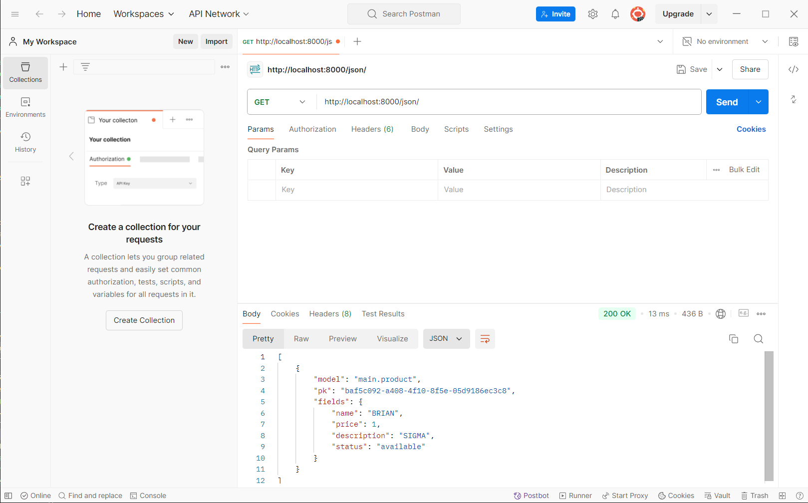
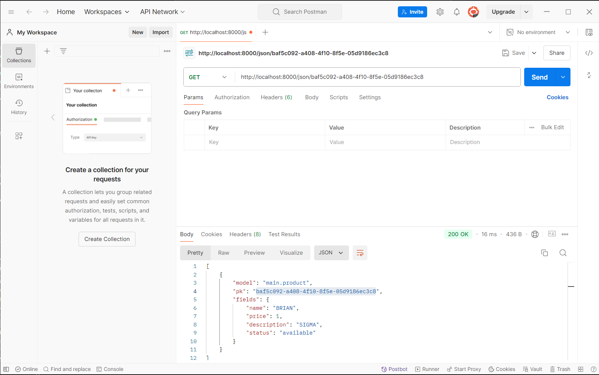

# VirtualShop

## Explain how you implemented the checklist above step-by-step (not just following the tutorial).

First, I created a new folder called VirtualShop, then set up the environment and installed the required libraries from the requirements.txt file. Once the setup was complete, I started a new Django project and created the main app. Now, I had two folders, main and VirtualShop, which I connected through urls.py and settings.py. Next, I created the product model, giving it attributes like name, price, description, and status. Since I was using a model, I created an admin account so I could manage products through the admin interface at "http://127.0.0.1:8000/admin/". After that, I updated views.py to display the products and created the templates/main.html file to render them. Once everything worked, I created a new GitHub repository to connect it to PWS. After using git add, commit, and push, my program was ready to be deployed on PWS, and my website was successfully launched. 

## Create a diagram that contains the request client to a Django-based web application and the response it gives, and explain the relationship between urls.py, views.py, models.py, and the html file.

Client (browser Makes HTTP Request) ---> urls.py (URL routing) ---> models.py(Database) --> HTML Template ---> loop back to urls.py

## Explain the use of git in software development!

Git is a tool used in software development to track code changes and help developers work together smoothly. It allows multiple people to work on a project at the same time without interfering with each other's work. Git keeps a record of all changes, making it easy to go back to earlier versions if needed and see who made updates. It also has features like branching and merging, which let developers work on new features or fix bugs separately before combining them into the main project, making teamwork and project management easier.

## In your opinion, out of all the frameworks available, why is Django used as the starting point for learning software development?

In my opinion, Django is a great starting point for learning software development because it simplifies complex tasks, letting you focus on core concepts. It comes with built-in tools like authentication and an admin panel. I love how its structure guides you into best practices, making it easier to understand web development fundamentals.

## Why is the Django model called an ORM?

Because Django models allow you to work with databases using Python code rather than SQL, they are also known as ORMs. In Django, every model is a table, with the fields mapping to the columns of the table. Because you can add or update records using straightforward Python commands rather than using SQL queries, this makes database management much simpler. It really improves the entire working with database.

# Assignment 3

## Explain why we need data delivery in implementing a platform?

Data delivery is key to making a platform functional because it's what ensures that all the pieces work together, whether it’s a user requesting information, the platform processing data, or syncing with external services. If data isn’t delivered properly, you’re left with a platform that feels slow, unreliable, or downright broken. It’s not just about moving information from one place to another, but doing it efficiently so users can have a seamless experience without delays or errors.

## In your opinion, which is better, XML or JSON? Why is JSON more popular than XML?

Personally, I think JSON is far better than XML for most situations. JSON is easier on the eyes, simpler to write, and works beautifully with JavaScript, which is everywhere nowadays. XML, while powerful, feels bloated and over-complicated for many tasks that JSON handles more cleanly and quickly. JSON's popularity really comes down to its ease of use in web development, especially when you're working with APIs. It gets the job done with less fuss and better performance, which is why most developers prefer it.

## Explain the functional usage of is_valid() method in Django forms. Also explain why we need the method in forms?

The is_valid() method in Django forms is like a checkpoint for your data, making sure that everything is in order before you move forward. It’s there to ensure that the data submitted by users passes the necessary validation checks and that only clean, usable information gets processed. Without it, you'd be risking errors or even security issues caused by faulty or malicious data. It's not just about following the rules; it’s about protecting the integrity of your app and ensuring smooth interactions for everyone involved.

## Why do we need csrf_token when creating a form in Django? What could happen if we did not use csrf_token on a Django form? How could this be leveraged by an attacker?

Using csrf_token in Django forms is crucial because it adds a layer of security that helps protect your app from malicious attacks, specifically CSRF attacks. If we didn’t include it, attackers could easily trick users into performing unwanted actions, like making transactions or changing account settings, without their knowledge. It’s a simple token, but without it, your app is left vulnerable to hackers who could exploit user trust and mess with sensitive data. So, it’s a small but vital piece of security that shouldn’t be overlook.

## Explain how you implemented the checklist above step-by-step (not just following the tutorial).

First, i create a new file called form.py consisting the model and the fields. After that I created the 4 views requested from the assignment. After that, I renew the main.html and make the base.html and create_product_entry.html. Now after all of this I route all of the views in the urls.py. Lastly, I modify settings.py templates, now I could add product through the form in the web

## POSTMAN RESULT

### XML

### XML ID

### JSON

### JSON ID

LINKS TO MY ASSIGNMENT 2: http://muhammad-brian31-virtualshop.pbp.cs.ui.ac.id/